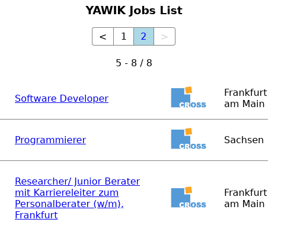

## Welcome to YAWIK Vue Joblist Widget

Display your YAWIK jobs on any website using a vue-custom-component.

### Example



### Usage

Include the following html snippets in your site:
``` html
<link rel="stylesheet" href="https://cross-solution.github.io/yawik-vue-joblist-widget/dist/0.1.0/yawik-job-list.css" />
<script src="https://cross-solution.github.io/yawik-vue-joblist-widget/dist/0.1.0/yawik-job-list.js"></script>
<yawik-job-list remote="[yawik-instance/jobboard]"></yawik-job-list>
```

Available attributes:

| Attribute | Description | 
| :--- | :--- |
| remote | URL to the yawik jobboard. e.g. https://yawik.org/demo/de/jobboard |
| count | Amount of jobs displayed at once. | 
| widget-title | Headline displayed above the jobs (default: YAWIK Job List) | 
| org | ID of an organization. If given, only jobs from this organization are displayed | 

### Files

#### 0.1

* [yawik-job-list.js](dist/0.1.0/yawik-job-list.js)
* [yawik-job-list.css](dist/0.1.0/yawik-job-list.css)

